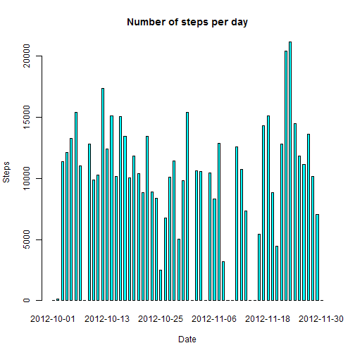
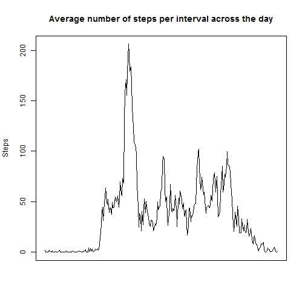
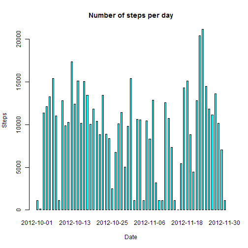
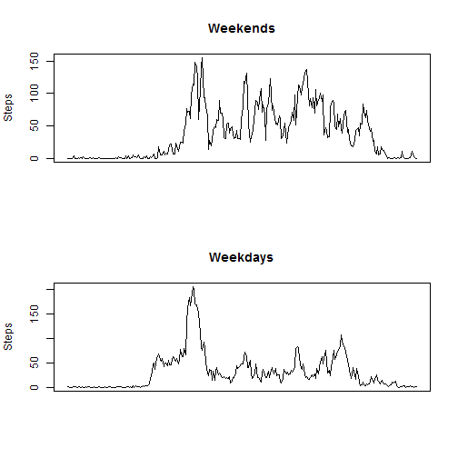

# Reproducible Research: Peer Assessment 1


## Loading and preprocessing the data

```r
unzip("activity.zip")
data <- read.csv("activity.csv")
```


## What is mean total number of steps taken per day?

```r
display_steps_summary <- function(disp_data) {    
    sum_steps <- with(disp_data, tapply(steps, date, sum, na.rm = TRUE))
    barplot(sum_steps, xlab = "Date", ylab = "Steps", 
            main = "Number of steps per day", 
            space = 1.05, col = "cyan")
    
    mean_steps <- mean(sum_steps)
    median_steps <- median(sum_steps)
    
    print(paste("Mean total number of steps per day: ",  
                             round(mean_steps, digits = 2), sep = ""))
    print(paste("Median total number of steps per day: ",  
                              round(median_steps, digits = 2), sep = ""))
}

display_steps_summary(data)
```

 

```
## [1] "Mean total number of steps per day: 9354.23"
## [1] "Median total number of steps per day: 10395"
```


## What is the average daily activity pattern?

```r
mean_steps <- with(data, tapply(steps, interval, mean, na.rm = TRUE))
plot(mean_steps, type = "l", xlab = "", ylab = "Steps", xaxt = "n", 
     main = "Average number of steps per interval across the day")
```

 

```r
max_mean_steps <- max(mean_steps)
max_mean_steps_ind <- which(mean_steps == max_mean_steps)
print(paste("Maximum number of steps accross a day: ", 
                           round(max_mean_steps, digits = 2), 
                           ". The interval number is: ",
                           max_mean_steps_ind,
                           sep = ""))
```

```
## [1] "Maximum number of steps accross a day: 206.17. The interval number is: 104"
```


## Imputing missing values

```r
missing_steps <- data[is.na(data$steps),]
missing_steps_count <- nrow(missing_steps)
print(paste("Total number of row with missing values: ",
            missing_steps_count, sep = ""))
```

```
## [1] "Total number of row with missing values: 2304"
```

```r
# fill missing steps with median values
median_values <- with(data, tapply(steps, interval, median, na.rm = TRUE)) 
median_values <- rep(median_values, missing_steps_count/length(median_values))
missing_steps$steps <- median_values

# result data contains original data with non-missing steps
# anddata where missing steps filled with median values
result_data <- data[!is.na(data$steps),]
result_data <- rbind(result_data, missing_steps)
result_data <- result_data[with(result_data, order(date, interval)),]

display_steps_summary(result_data)
```

 

```
## [1] "Mean total number of steps per day: 9503.87"
## [1] "Median total number of steps per day: 10395"
```
If the missing step values are replaced with median values, the result chart
is pretty the same as we saw in the first part of the assignment.  
Logically the median value across the steps remains the same and a mean value
slightly changes but not significant.  


## Are there differences in activity patterns between weekdays and weekends?

```r
library(chron)
result_data$is_weekend <- is.weekend(result_data$date)
result_data$is_weekend = as.factor(result_data$is_weekend)

weekend_steps <- with(result_data[result_data$is_weekend == TRUE,], 
                      tapply(steps, interval, mean, na.rm = TRUE))
weekday_steps <- with(result_data[result_data$is_weekend == FALSE,], 
                      tapply(steps, interval, mean, na.rm = TRUE))

par(mfrow = c(2, 1))
plot(weekend_steps, type = "l", xlab = "", ylab = "Steps", 
     xaxt = "n", main = "Weekends")
plot(weekday_steps, type = "l", xlab = "", ylab = "Steps", 
     xaxt = "n", main = "Weekdays")
```

 
