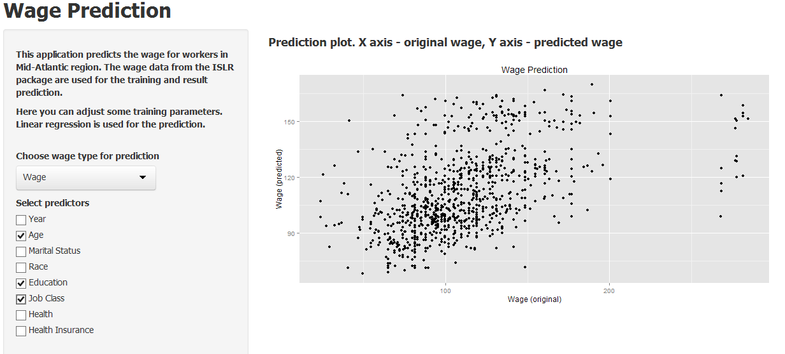

## Course project Shiny App introduction

Wage Prediction Application has been created for Developing Data Products
course [@Coursera](https://www.coursera.org/course/devdataprod).

- It is a [Shiny Application](http://shiny.rstudio.com/)
- It predicts the [wage](http://www.inside-r.org/packages/cran/ISLR/docs/Wage) 
of workers in the Mid-Atlantic region and displays prediction results in a plot
- It allows to select predicted variables and predictors and specify plot labels
- It uses [reactivity](http://shiny.rstudio.com/tutorial/lesson6/) to avoid
unnecessary calculations

--- .class #id 

## Data source

We're predicting the wage or log(wage) of workers in the Mid-Atlantic region 
using multiple predictors.

```{r, echo=FALSE}
library(ISLR)
data(Wage)
str(Wage)
```

--- 

## Settings

In the application you have a possibility to select the **predicted value** and 
**predictors**. Notice that sex and region predictors cannot be selected and are not
taken into account since they have always the same value.

```{r, echo=TRUE}
nrow(Wage[Wage$sex != "1. Male",])
```

```{r, echo=TRUE}
nrow(Wage[Wage$region != "2. Middle Atlantic",])
```

Finally you can specify the **title** and **axis lables** of the resulting plot.

--- 

## Predicting and showing results

- If you do not select any predictors then, obviously, you do not see any results
- 70% of Wage data is used for the training and 30% as a testing set by the 
prediction
- Linear regression method is used for the prediction
- The resulting plot compares predicted and original wage values

</img>
